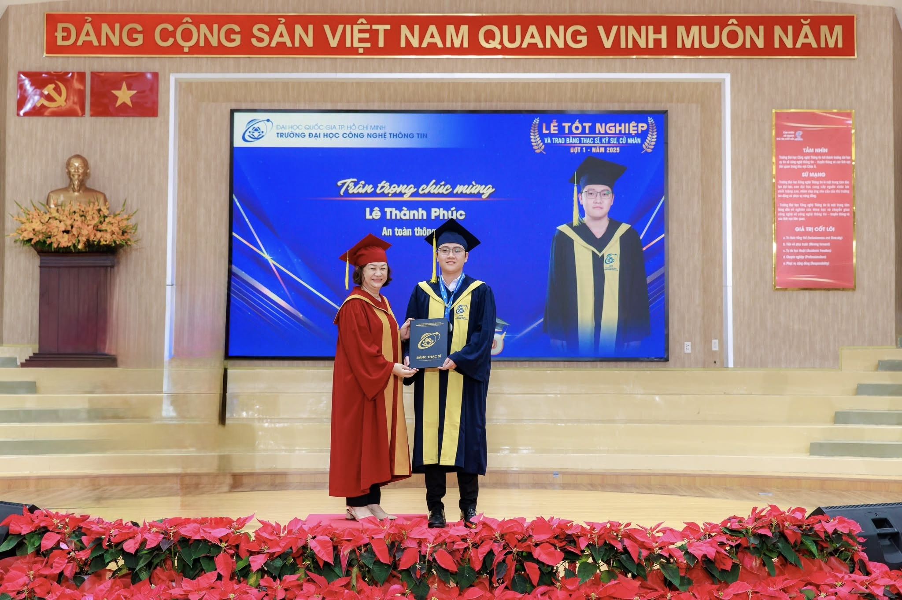

# 👋 Hi there,

### Welcome to YangYang Research Organization

## Goals

💡 Research and development of security products

🔎 Finding Security Vulnerabilities in Open Source Repositories

🧑‍🏫 Guide students in scientific research in the field of information security

## Public Resources

📦 Huggingface : [YangYang-Research](https://huggingface.co/YangYang-Research)

📦 AWS ECR : [YangYang-Research](https://gallery.ecr.aws/j8d4r7c5?page=1)

## Products

🐋 Whale-Sentinel : **Whale Sentinel** is a comprehensive cybersecurity platform designed to protect modern applications—from web to mobile and endpoint environments—against a wide range of cyber threats. [Explore](https://github.com/YangYang-Research/whale-sentinel)

## Founder

### 👨‍🎓 Master of Science in Information Security - Le Thanh Phuc aka Pk

## Contact for work

Linkedin : [ltp-noobpk](https://www.linkedin.com/in/ltp-noobpk/)

Email : [yangyang.organization@gmail.com](mailto:yangyang.organization@gmail.com)

Telegram : [noobpk](https://t.me/noobpk)